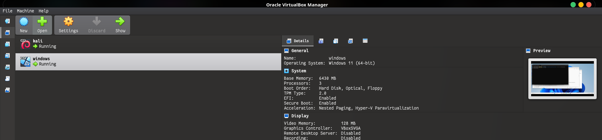
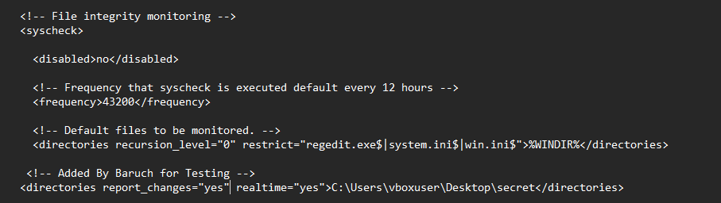
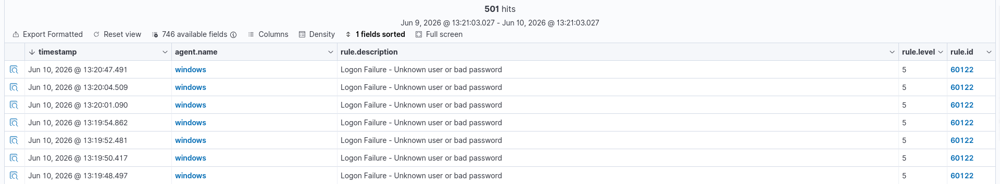
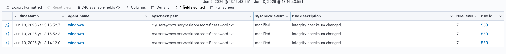

## 🛡️ Wazuh Lab: Monitoring Windows VM


## Watching my Windows For Sus Activities (with Wazuh)
I set up Wazuh to monitor a Windows VM on my laptop. The goal was simple. To catch two things in real time:

- **Failed logins** (password attack simulation)
- **File changes** (FIM)

Here’s exactly how I went about it:

## What I used 🧰
- **Wazuh Manager** (Kali Linux VM)  
- **Wazuh Agent** (Windows 11 VM)  
Both are running in VirtualBox on my laptop




## What I configured on Windows ⚙️

### File Integrity Monitoring (FIM) 🔒

I configured my Wazuh to watch a specific folder, in my case:

- Path: `C:\Users\vboxuser\Desktop\secret`
- Action: Added this to the agent’s `ossec.conf`:

```xml
<syscheck>
  <directories check_all="yes" realtime="yes">C:\Users\vboxuser\Desktop\secret</directories>
</syscheck>
```


This makes sure that every creation, modification or deletion in that directory would trigger an alert.

### Failed login detection 🔐

I opened the Windows VM and:

1. Tried to log in with a wrong password 7 times  
2. Modifed the contents inside a text file in the dir `C:\Users\vboxuser\Desktop\secret\password.txt` 

### What Wazuh caught (dashboard view)

**Failed logins** – Immediately showed up under *Security events* with source IP, username, and failure count.  
**File changes** – FIM alerted on file modification with timestamps and full path.




### Why this is Important?

File Integrity Monitoring detects unauthorized changes for example, ransomwares, backdoors and all those kind of stuffs as they happen, and failed-login alerts flag credential‑spraying attempt or probably a brute forcing taking place in either case it helps, so you can respond fast.