# Wazuh Lab: Monitoring a Windows VM

> A hands-on Security Monitoring lab using Wazuh SIEM, deployed on VirtualBox with Kali Linux (manager) and Windows 11 (agent).

**Full write-up with detailed screenshots:** [View the Lab Report PDF](./docs/wazuh-doc.pdf)


## Table of Contents

- [Executive Summary](#executive-summary)
- [Objectives](#objectives)
- [What is Wazuh?](#what-is-wazuh)
- [Key Concepts](#key-concepts)
- [Tools Used](#tools-used)
- [Installation & Setup](#installation--setup)
  - [Environment Setup (VirtualBox)](#environment-setup-virtualbox)
  - [Wazuh Manager (Kali Linux)](#wazuh-manager-kali-linux)
  - [Wazuh Agent (Windows 11)](#wazuh-agent-windows-11)
  - [FIM Configuration](#fim-configuration-file-integrity-monitoring)
- [Attack Simulations](#attack-simulations)
  - [Brute-Force Attack](#brute-force-attack)
  - [Ransomware File Modification](#ransomware-file-modification)
- [Verification in Wazuh](#verification-in-wazuh)
  - [Checking Brute-Force Logs](#checking-brute-force-logs)
  - [Checking FIM Logs](#checking-fim-logs)
- [Why This Matters](#why-this-matters)
- [Conclusion](#conclusion)


## Executive Summary

This project demonstrates a hands-on security monitoring lab using **Wazuh**, an open-source SIEM (Security Information and Event Management) platform. A Wazuh manager was deployed on a **Kali Linux VM** and a Wazuh agent on a **Windows 11 VM**, both running in VirtualBox on a single laptop.

The goal was to detect two common attack indicators in real time:
- **Failed login attempts**: simulating a password/brute-force attack
- **Unauthorized file changes**: using File Integrity Monitoring (FIM)

Both events were successfully captured and alerted on by Wazuh.


## Objectives

- Set up and deploy a fully functional Wazuh SIEM lab using virtual machines on a laptop
- Configure the Windows agent to monitor a specific directory for file changes (FIM) in real time
- Simulate a brute-force attack by entering wrong passwords and observe how Wazuh logs the failures
- Document the entire process with screenshots to showcase the ability to set up, configure, and validate a security monitoring tool

---

## What is Wazuh?

**Wazuh** is a free, open-source SIEM platform that:
- Collects and analyzes security data from endpoints
- Detects threats like intrusions, malware, or policy violations
- Sends real-time alerts

It works by installing a lightweight **agent** on monitored systems (e.g., Windows, Linux) that forwards logs to a central **manager** with a web dashboard.


## Key Concepts

<details>
<summary><b>Brute-Force Attack</b></summary>

An attacker repeatedly attempts to log into a system using many different passwords (or commonly used passwords across many accounts) to gain unauthorized access.

**Windows Event ID `4625`**(Failed logon): is the primary indicator of such activity. Monitoring these failures in real time allows defenders to detect and block the attack early.

</details>

<details>
<summary><b>Malware / Backdoor File Modification</b></summary>

Malicious software often modifies, encrypts, or deletes files on a compromised system. **File Integrity Monitoring (FIM)** detects unauthorized changes to critical files or directories.

By alerting on any modification, creation, or deletion, FIM helps identify ransomware activity, backdoor payloads, or insider threats as they happen.

</details>


## Tools Used

| Role | Tool |
|------|------|
| **SIEM Manager** | Kali Linux VM (central server) |
| **Monitored Endpoint** | Windows 11 VM (Wazuh agent) |
| **Hypervisor** | VirtualBox (running both VMs on one laptop) |

---

## Installation & Setup

<details>
<summary><b>Environment Setup (VirtualBox)</b></summary>

1. Downloaded and installed **VirtualBox** from the [official website](https://www.virtualbox.org)
2. Created two VMs: **Kali Linux** (manager) and **Windows 11** (agent)

**Steps to create a VM:**

- **Step 1:** Clicked the **"New"** button to get started

  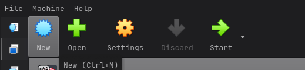

- **Step 2:** Filled in the required details: VM Name, VM Folder (left as default), and ISO Image path (Windows ISO downloaded from the official Microsoft website)

  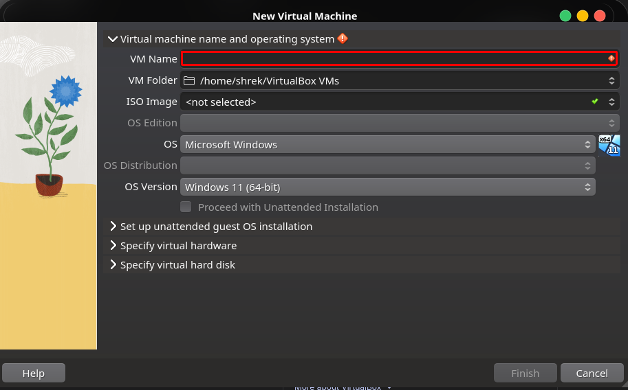

- **Step 3:** Switched to the **"Virtual Hardware"** tab and adjusted RAM and CPU

  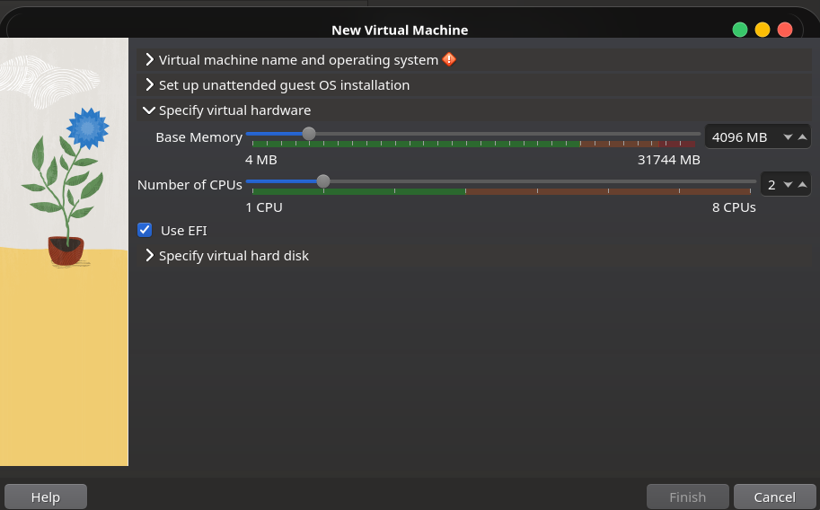

- **Step 4:** Switched to the **"Virtual Hard Disk"** tab and adjusted storage, then clicked **"Next"** to create the VM

  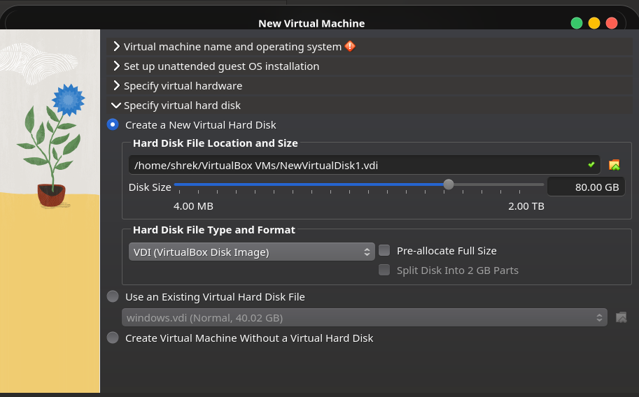

- **Step 5:** Selected the Kali VM → **Settings → Network** → changed **"Attached To"** to **"Bridged Adapter"**

  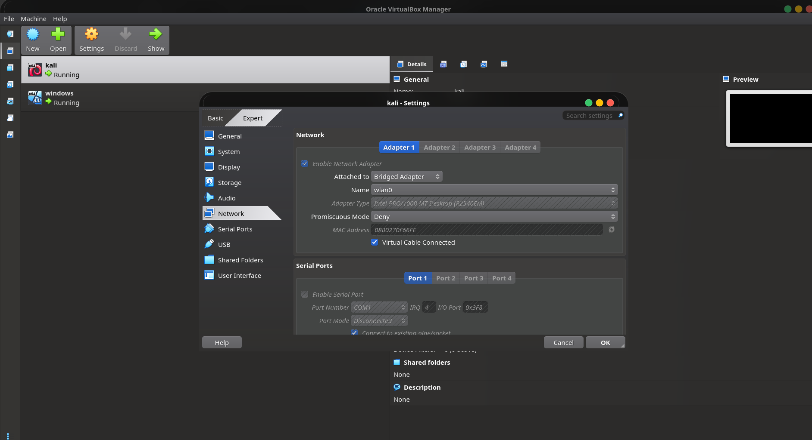

- **Step 6:** Booted the Windows VM and completed the on-screen setup; repeated similar steps for Kali Linux

</details>

<details>
<summary><b>Wazuh Manager (Kali Linux)</b></summary>

1. Booted into the Kali machine
2. Ran the official Wazuh all-in-one installation command from the [Wazuh Quickstart page](https://documentation.wazuh.com/current/quickstart.html)
3. After installation, credentials (username: `admin` + generated password) were displayed in which was saved for later login
   
   Credentials can be retrieved anytime with:
   ```bash
   sudo tar -O -xvf wazuh-install-files.tar wazuh-install-files/wazuh-passwords.txt
   ```

4. Checked the Kali machine's IP address:
   ```bash
   ip addr show
   ```
   (`eth0` = main IP, `lo` = loopback/localhost)

   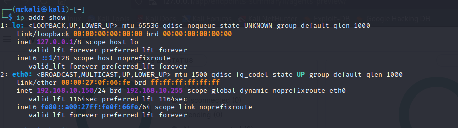

5. Started Wazuh services:
   ```bash
   sudo systemctl start wazuh-indexer wazuh-manager wazuh-dashboard
   ```

6. Verified services were running:
   ```bash
   sudo systemctl status wazuh-indexer wazuh-manager wazuh-dashboard
   ```

   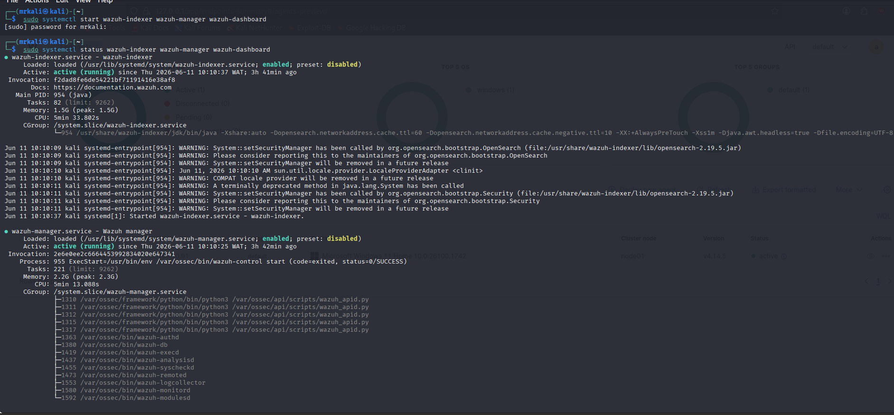

7. Accessed the **Wazuh dashboard** in Firefox by navigating to the Kali machine's IP address and logging in with the saved credentials

   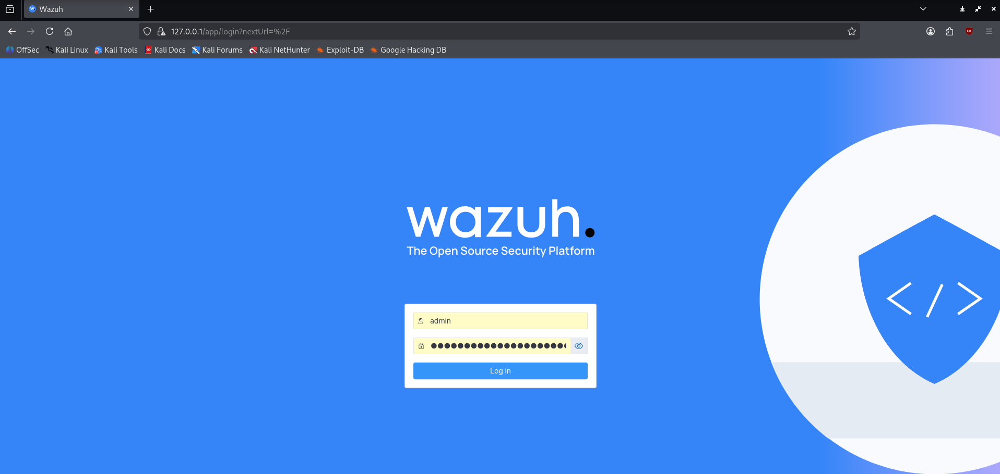

   
   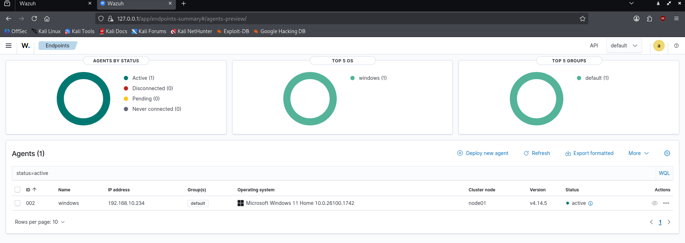

</details>

<details>
<summary><b>Wazuh Agent (Windows 11)</b></summary>

1. On the Wazuh dashboard (Kali), navigated to **Agent Management → Deploy New Agent**

   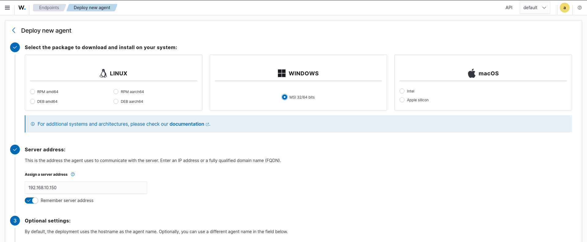

2. Selected the agent's operating system (**Windows**) and entered the Kali server's IP address
3. A **PowerShell command** was generated and copied from the dashboard

   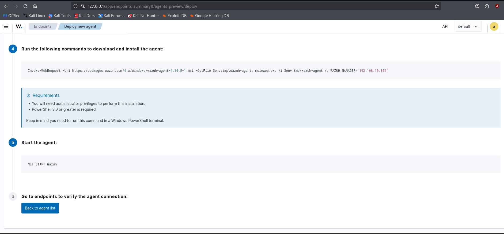

4. Booted into the Windows VM and opened **PowerShell as Administrator**
5. Pasted and ran the copied PowerShell command: this installs the Wazuh agent on the Windows endpoint

   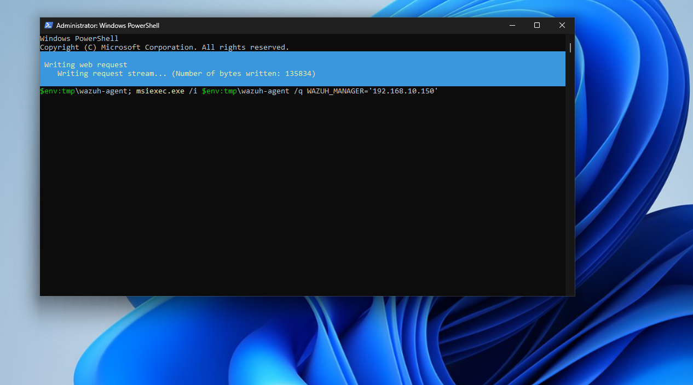

6. Started the agent service:
   ```powershell
   NET START Wazuh
   ```
7. Verified the agent was running:
   ```powershell
   Get-Service -Name Wazuh
   ```

   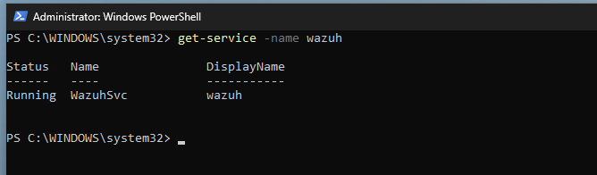

</details>

<details>
<summary><b>FIM Configuration (File Integrity Monitoring)</b></summary>

1. On the Windows machine, opened **File Explorer** and navigated to:
   ```
   C:\Program Files (x86)\ossec-agent
   ```

2. Located the `ossec.conf` file, this stores configuration, connection details, rules, and other agent settings

3. Opened `ossec.conf` in **Notepad as Administrator**

   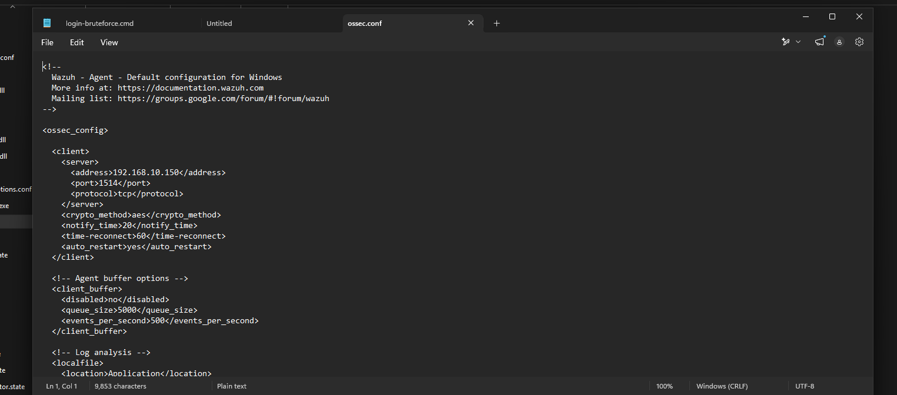

4. Used `Ctrl + F` to find the `<syscheck>` block and added the following rule to monitor a specific directory (including all subdirectories and files) in real time:
   ```xml
   <directories check_all="yes" realtime="yes">C:\Users\vboxuser\Desktop\secret</directories>
   ```

   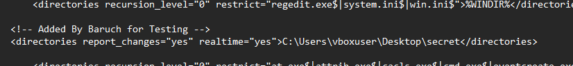

5. Restarted the agent service to apply the changes:
   ```powershell
   NET STOP Wazuh
   NET START Wazuh
   ```

</details>


## Attack Simulations

<details>
<summary><b>Brute-Force Attack</b></summary>

1. On the Windows machine, created a simple script to simulate a brute-force login attempt:
   - Right-clicked the Desktop → created a new `.txt` file
   - Wrote the script inside it, then renamed the file extension from `.txt` to `.cmd`

   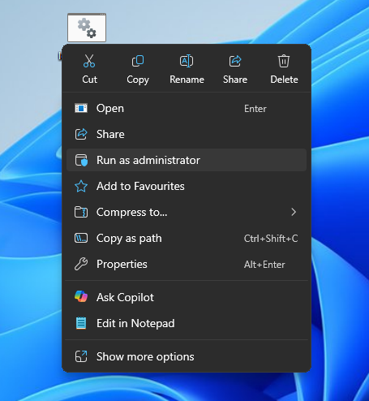

2. Right-clicked the script and selected **"Run as Administrator"** to execute the brute-force simulation

3. Multiple failed login attempts were triggered and appeared in the command line output

   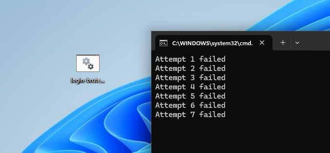

</details>

<details>
<summary><b>Ransomware File Modification</b></summary>

1. On the Windows machine, created a `.cmd` script (same method as above) to simulate a ransomware attack on the watched folder

   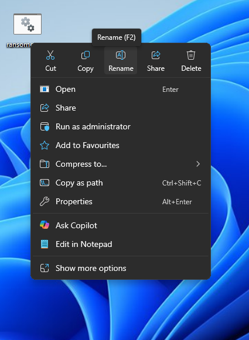

2. Right-clicked the script and selected **"Run as Administrator"**, just like we did with the cmd script

3. Navigated to the watched folder to verify the attack worked:
   ```
   C:\Users\vboxuser\Desktop\secret\password.txt
   ```

   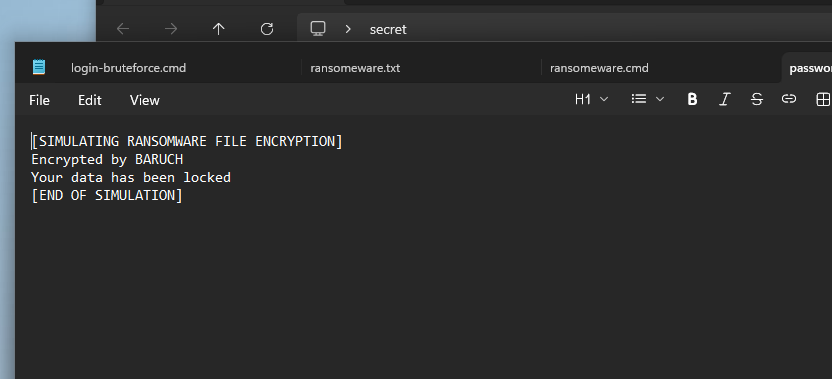

</details>


## Verification in Wazuh

<details>
<summary><b>Checking Brute-Force Logs</b></summary>

1. Logged back into the Kali machine and opened the **Wazuh dashboard** in the browser
2. Navigated to **Security Operations → Threat Hunting → Events**
3. Clicked **"Add Filter"** and selected `data.win.system.eventID` = `4625` (Windows failed login event ID)

   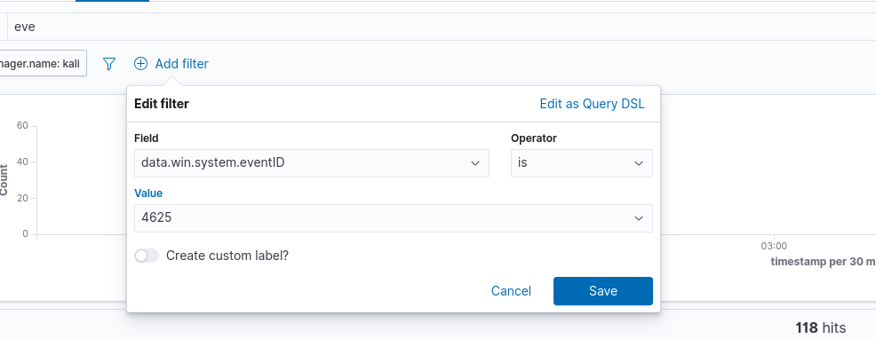

4. Clicked **"Save"**, Wazuh filtered and displayed all matching failed login events

   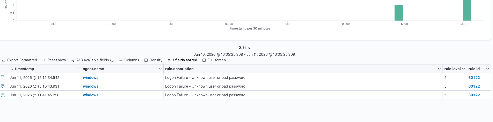

5. Clicked the magnifying glass icon on a result to expand details, this revealed the **username**, **userID**, **operating system**, and more

   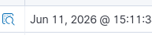
   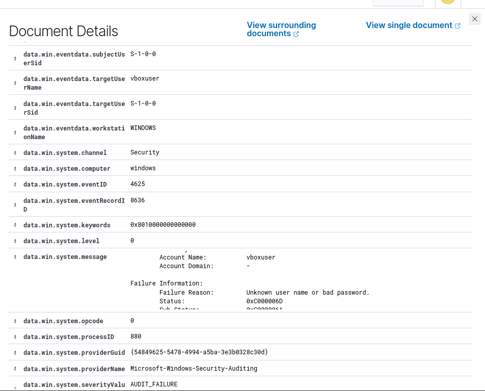

</details>

<details>
<summary><b>Checking FIM Logs</b></summary>

1. On the same **Events** page, added a new filter: `rule.id` = `550` (standard Wazuh rule ID for FIM alerts)

   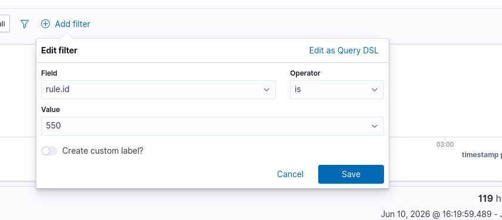

2. Filtered results appeared showing all file modification events

   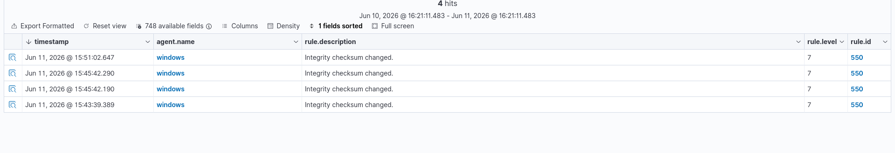

3. Expanded individual results to view full details of the detected file changes

   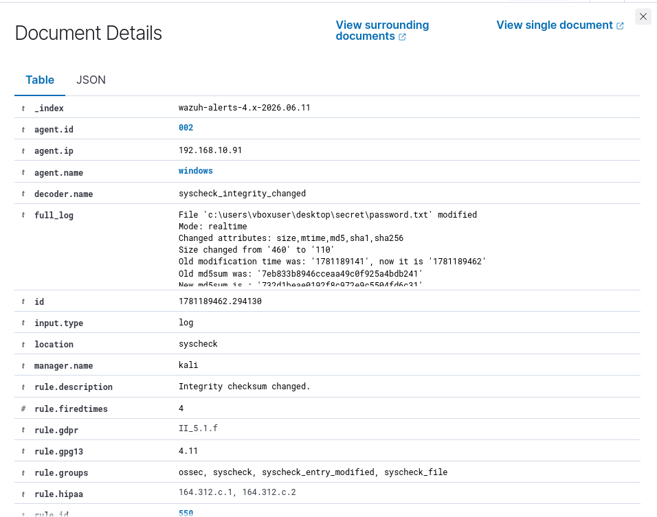

</details>

## Challenges Encountered

- **Virtual Machine Networking:** Default NAT settings in VirtualBox prevent direct communication between VMs. It was resolved by configuring the network settings to use a Bridged Adapter (placing both the Kali Linux and Windows on the same network)
- **Enabling Real-Time FIM:** By default, Wazuh's syscheck module runs periodic scans. Detecting the ransomware simulation immediately required modifying the agent's `ossec.conf` file to include the `realtime="yes"` parameter for the specific target directory.
- **Execution Restrictions:** Normal user accounts lack the permissions to modify protected files. The simulated attack scripts (`.cmd`) needed to be executed with Administrator privileges to function correctly and trigger the alerts.

## Future Enhancements

- **Active Response Configuration:** Implement Wazuh Active Response to automatically execute a script that blocks the attacker's IP address in the Windows Firewall after a specific threshold of failed login attempts.
- **Sysmon Integration:** Install Microsoft Sysmon on the Windows endpoint and configure Wazuh to ingest its logs. This provides deeper system telemetry, including process creation and network connections, beyond standard Windows Event Logs.
- **Vulnerability Detection:** Enable the Wazuh Vulnerability Detector module to automatically scan the Windows agent for missing OS patches and vulnerable third-party software.


## Conclusion

- **From Setup to Action**: Built a full Wazuh SIEM lab using two VMs, proving that enterprise-grade security monitoring is accessible on a laptop
- **Proactive Detection**: Used FIM to spot ransomware-like file modifications in real time and Windows event analysis to detect brute-force attempts
- **Hands-on Validation**: Simulated real-world attacks with scripts and used the Wazuh dashboard to verify detection